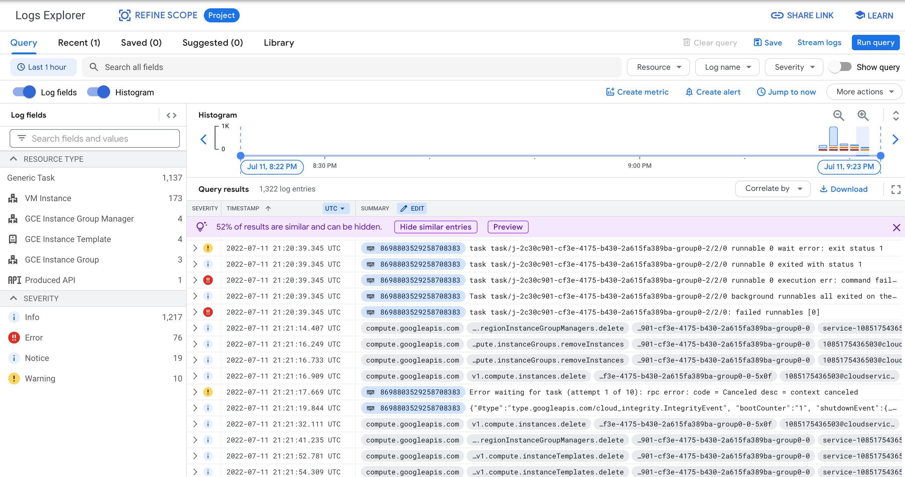

# Transcoding with Batch

Batch is a job scheduler that manages and runs batch jobs on Google Cloud. In this tutorial, you will learn how to use Batch to schedule batch workloads with a video transcoding example.

We'll use the [Google Cloud CLI](https://cloud.google.com/sdk/gcloud) (gcloud) to work with Batch and other Google Cloud features.

## Before you start

1. [Install](https://cloud.google.com/sdk/docs/install) and [initialize](https://cloud.google.com/sdk/docs/initializing) the Google Cloud CLI.
2. Instal the beta component to the gcloud command (run `gcloud components install beta`).
3. Make sure that billing is enabled for your Cloud project. Learn how to [check if billing is enabled on a project](https://cloud.google.com/billing/docs/how-to/verify-billing-enabled).

## Create a new project

We recommend creating a new project for this tutorial so that it doesn't affect any other existing projects you might have on Google Cloud. It is also easier to clean up resources when you finish.

To create a new project, run:

```
gcloud projects create [PROJECT_ID]
```

We'll use the `[PROJECT_ID]` you specified for the rest of this tutorial. To change the default project for `gcloud`, run:


```
gcloud config set project [PROJECT_ID]
```

See the document to learn more about [creating and managing projects](https://cloud.google.com/resource-manager/docs/creating-managing-projects).


## Enable the Batch API

First, run the following command to enable the Batch API. You need to do this when you use Batch for the first time in a project.

```
gcloud services enable batch.googleapis.com
```

## Prepare a Cloud Storage bucket

You can use a Cloud Storage bucket to store objects for Batch jobs. We recommend creating a new bucket so that it doesn't affect other data you might have on Google Cloud.
In this tutorial, we'll use `[BUCKET_NAME]` as a placeholder of the bucket name you use and you need replace it with an actual bucket name you're using.

Run the following commands to create a new bucket and copy tutorial files to the bucket.
Make sure you're in this `transcoding` directory.

```
gsutil mb -p [PROJECT_ID] -b on -l US gs://[BUCKET_NAME]
gsutil cp -R transcode.sh input gs://[BUCKET_NAME]
```

To learn more about creating storage buckets, see the [Cloud Storage documentation](https://cloud.google.com/storage/docs/creating-buckets).

## Define a job

Batch manages a collection of tasks as a job.
In this tutorial, you'll create a job that has a task to encode video files with the [VP9 codec](https://developers.google.com/media/vp9).

First, open the [job.json](job.json) file with a text editor and change `[BUCKET_NAME]` to your bucket name, and save the file.

The JSON file defines a job with the following specifications:
- A task specification.
  - Run `bash /mnt/share/transcode.sh` as the task.
  - Each task requires 2 vCPUs and 2 GiB of memory.
  - The maximum number of retries is two.
  - The maximum duration is 600 seconds.
  - Mount `[BUCKET_NAME]` as `/mnt/share`.
  - There are three tasks with this specification.
  - Batch should run at most two tasks at the same time.
- An allocation policy to use spot [n2d-standard-4](https://cloud.google.com/compute/docs/general-purpose-machines) instances to run the tasks.

## Submit the job

To run the Batch job, you first need to submit it to Batch.
The following command will submit a job named `transcode` using the definition in `job.json` in the us-central1 region.

```
gcloud beta batch jobs submit transcode --location=us-central1 --config=job.json
```

The command output should look like the following (note the first line with "Job … was successfully submitted).


```yaml
Job j-7e152098-2f6f-4016-bee4-be8db1a448d4 was successfully submitted.
allocationPolicy:
  instances:
  - policy:
      machineType: n2d-standard-4
      provisioningModel: SPOT
createTime: '2022-07-11T18:09:08.328228956Z'
labels:
  department: creative
  env: testing
logsPolicy:
  destination: CLOUD_LOGGING
name: projects/[PROJECT_ID]/locations/us-central1/jobs/transcode
status:
  runDuration: 0s
  state: QUEUED
taskGroups:
- name: projects/xxx/locations/us-central1/jobs/transcode/taskGroups/group0
  parallelism: '2'
  taskCount: '3'
  taskSpec:
    computeResource:
      cpuMilli: '2000'
      memoryMib: '2048'
    maxRetryCount: 2
    maxRunDuration: 3600s
    runnables:
    - script:
        text: bash /mnt/share/transcode.sh
    volumes:
    - gcs:
        remotePath: [BUCKET_NAME]
      mountPath: /mnt/share
uid: j-7e152098-2f6f-4016-bee4-be8db1a448d4
updateTime: '2022-07-11T18:09:08.328228956Z'
```

## Check the job status

You can check the current status of the job by running the `batch jobs describe` command.

```
gcloud beta batch jobs describe transcode --location=us-central1
```

Check if the state is `SCHEDULED`, which means the job is scheduled to run and Batch is preparing resources.
It will change to `RUNNING` once Batch finishes preparing virtual machines and starts running the tasks defined in the job.

The command output should look like this:

```yaml
allocationPolicy:
  instances:
  - policy:
      machineType: n2d-standard-4
      provisioningModel: SPOT
createTime: '2022-07-11T18:09:08.328228956Z'
labels:
  department: creative
  env: testing
logsPolicy:
  destination: CLOUD_LOGGING
name: projects/[PROJECT_ID]/locations/us-central1/jobs/transcode
status:
  runDuration: 0s
  state: SCHEDULED
  statusEvents:
  - description: Job state is set from QUEUED to SCHEDULED for job projects/xxx/locations/us-central1/jobs/transcode.
    eventTime: '2022-07-11T18:09:13.685880628Z'
    type: STATUS_CHANGED
  taskGroups:
    group0:
      counts:
        PENDING: '2'
      instances:
      - machineType: n2d-standard-4
        provisioningModel: SPOT
        taskPack: '2'
taskGroups:
- name: projects/xxx/locations/us-central1/jobs/transcode/taskGroups/group0
  parallelism: '2'
  taskCount: '3'
  taskSpec:
    computeResource:
      cpuMilli: '2000'
      memoryMib: '2048'
    maxRetryCount: 2
    maxRunDuration: 3600s
    runnables:
    - script:
        text: bash /mnt/share/transcode.sh
    volumes:
    - gcs:
        remotePath: [BUCKET_NAME]
      mountPath: /mnt/share
uid: j-7e152098-2f6f-4016-bee4-be8db1a448d4
updateTime: '2022-07-11T18:09:13.685880628Z'
```

You can see the Compute Engine instances Batch has created to run the job.

```
gcloud compute instances list
```

The output looks like this (the exact machine name changes every time):

```
NAME                                                  ZONE           MACHINE_TYPE     PREEMPTIBLE  INTERNAL_IP    EXTERNAL_IP     STATUS
j-7e152098-2f6f-4016-bee4-be8db1a448d4-group0-0-rswj  us-central1-c  n2d-standard-4   true         10.128.15.201  34.69.6.37      RUNNING
```

## Check the logs with Cloud Logging

The job should finish in about 5 mins.
You can see the progress by looking at the log with Cloud Logging.

Open the [Cloud Logging Console](https://console.cloud.google.com/logs/query) and inspect the log.
It has console outputs from the tasks as well as Compute Engine operation history managed by Batch.

Here's a screenshot of what it looks like:



You can also check if the job has finished with the gcloud command.

```
gcloud beta batch jobs describe transcode --location=us-central1
```

The status should look like this when the job has finished successfully.

```yaml
status:
  runDuration: 189.977260261s
  state: SUCCEEDED
  statusEvents:
  - description: Job state is set from QUEUED to SCHEDULED for job projects/xxx/locations/us-central1/jobs/transcode.
    eventTime: '2022-07-11T21:29:14.814261477Z'
    type: STATUS_CHANGED
  - description: Job state is set from SCHEDULED to RUNNING for job projects/xxx/locations/us-central1/jobs/transcode.
    eventTime: '2022-07-11T21:31:22.171146401Z'
    type: STATUS_CHANGED
  - description: Job state is set from RUNNING to SUCCEEDED for job projects/xxx/locations/us-central1/jobs/transcode.
    eventTime: '2022-07-11T21:34:32.148406662Z'
    type: STATUS_CHANGED
```

## Check the encoded video files

The job stores encoded video files in the same Cloud Storage bucket. To list the objects, run:

```
gsutil ls -lR gs://[BUCKET_NAME]/output
```

It displays a list of the encoded video files.

```
gs://[BUCKET_NAME]/output/:
         0  2022-07-11T21:30:49Z  gs://[BUCKET_NAME]/output/
    832968  2022-07-11T21:34:20Z  gs://[BUCKET_NAME]/output/video-0.webm
    382292  2022-07-11T21:32:07Z  gs://[BUCKET_NAME]/output/video-1.webm
    469656  2022-07-11T21:34:27Z  gs://[BUCKET_NAME]/output/video-2.webm
TOTAL: 4 objects, 1684916 bytes (1.61 MiB)
```

You can also browse the objects with the [Console](https://console.cloud.google.com/storage/browser).

To download the files, run:

```
gsutil cp -R gs://[BUCKET_NAME]/output .
```

You will find the new files in the output directory inside the current directory.
You can open and watch the created video files with the Chrome browser.

## Delete the Batch job

To delete the batch job, run the `gcloud beta batch jobs delete` command.

```
gcloud beta batch jobs delete transcode --location=us-central1
```

## Clean up the resources

Batch automatically deletes the instances it created for each job, however, you might still be charged for storing the objects in Cloud Storage.
Make sure to delete the project you created to avoid incurring charges.
Deleting your Cloud project stops billing for all the resources used within that project.

```
gcloud projects delete [PROJECT_ID]
```

That's it! You've learned how to define and run Batch jobs on Google Cloud. Congratulations!
